# Ekstrem

Kredi kartı ekstresi PDF'lerini okuyup harcamalarını kategorilere ayıran, ay ay gösteren ve önümüzdeki ayları planlamaya yarayan bir **Android uygulaması**.
Bankanın gönderdiği ekstreyi seçmek yeterli: işlemler ayrıştırılır, bankanın kendi toplamıyla kuruşu kuruşuna doğrulanır ve infografiklere dönüşür.
Tüm veriler yalnızca telefonda saklanır; hiçbir sunucuya gönderilmez.

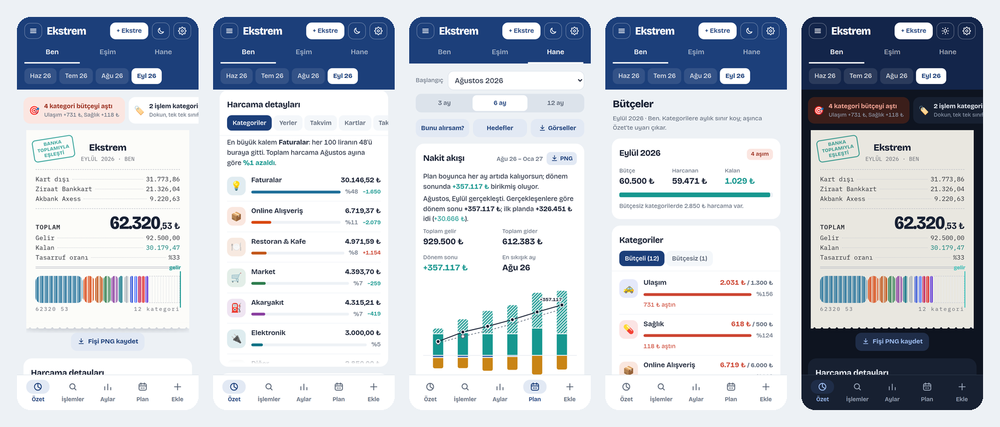

## Öne çıkanlar

- **Ekstreden otomatik okuma:** PDF ekstre seçilir, işlemler, taksitler, iadeler ve faizler ayrıştırılır. Her ekstre bankanın dönem borcu hesabıyla karşılaştırılır; tutan ekstreye "Banka toplamıyla eşleşti" kaşesi basılır.
- **Fiş görünümünde özet:** Ayın harcaması bankalara göre kalem kalem bir kasa fişinde. Barkodun çizgileri kategorilerin harcamadaki payını, firuze çizgi gelirin nereye kadar yettiğini gösterir.
- **Kategoriler ve arama:** 20 kategoriye otomatik ayırma, önceki aya göre farklar, işyeri, kategori, banka, tutar ya da tarihle arama. Bir işlemin kategorisini değiştirince aynı işyerinin tüm işlemlerine kural olarak uygulanabilir.
- **Harcama takvimi:** Günlük harcamalar ısı haritalı bir takvimde; en yoğun gün ve hafta sonu payı.
- **Kişiler:** Ben, Eşim ve ikisinin toplamı olan Hane sekmeleri. Her kart bir kez bir kişiye atanır, sonraki ekstreleri otomatik o kişiye gider.
- **Kart dışı harcamalar ve gelir:** Nakit, banka kartı ve havale harcamaları ile aylık gelirler elle girilir; özete, kategorilere ve plana dahil olur.
- **Plan:**
  - Önümüzdeki 3, 6 ya da 12 ayın nakit akışı. Kartlardaki kalan taksitler ekstrelerden kendiliğinden gelir; gelir ve gider kalemleri (her ay, belirli sayıda ay ya da tek seferlik) elle eklenir.
  - Her ayın bilançosu; artı bilanço sonraki aya gelir, eksi bilanço gider olarak devreder. Devirler elle düzenlenebilir.
  - Taksit takvimi: hangi taksidin hangi ay bittiği.
- **Plan ile gerçekleşen:** Bir ayın ekstreleri yüklenince ay "gerçekleşti" sayılır. Plan kalemleri ekstre, kart dışı kayıt ve girilen gelirlerle eşleştirilir; sapmalar raporlanır ve gerçekleşen bilanço sonraki ayların planına devreder.
- **Görsel çıktı:** Özet fişi, plan grafikleri, bilanço tablosu ve karşılaştırma raporu PNG olarak kaydedilir ya da paylaşılır.
- **Koyu tema**, kopya ekstre tespiti, yedekleme ve geri yükleme.

### Desteklenen bankalar

| Banka | Durum |
|---|---|
| Ziraat Bankkart | Gerçek ekstrelerle test edildi (TL ve USD işlemler, Bankkart Lira) |
| Akbank Axess | Gerçek ekstreyle test edildi (bankanın EBCDIC kodlu PDF metni çözülür) |
| Yapı Kredi World | Gerçek ekstreyle test edildi (ana kart, dijital kart, alt satırdaki taksitler) |
| Halkbank Paraf | Gerçek ekstreyle test edildi (çok satırlı açıklamalar, sayfa geçişi) |
| DenizBank | Gerçek ekstreyle test edildi (`895,99/3-2` biçimli taksitler) |
| Enpara.com | Gerçek ekstrelerle test edildi (eski ve yeni düzen) |
| İş Bankası Maximum | Ekstre görüntülerinden kurulan düzenle test edildi (`4/8 taksidi` biçimi) |
| Garanti BBVA Bonus | Ekstre görüntülerinden kurulan düzenle test edildi (tarihsiz faiz/BSMV satırları) |
| QNB, VakıfBank, TEB, ING, Kuveyt Türk, Türkiye Finans, Albaraka, Ziraat Katılım, Vakıf Katılım, Emlak Katılım, Şekerbank, Fibabanka, Odeabank, HSBC, Anadolubank, Burgan, Alternatif Bank, Papara | Banka adı tanınır; tablo düzenindeki ekstre genel ayrıştırıcıyla okunur. Test ekstresi olmadığından doğruluk garanti değildir. |

Her ekstre yüklenirken bankanın dönem borcuyla karşılaştırılır (`önceki borç + harcamalar − ödemeler/iadeler = dönem borcu`). Toplam tutmazsa içe aktarma ekranı uyarır; böyle bir ekstreyi [issue](../../issues) olarak bildirebilirsiniz (kişisel bilgileri karartarak).

## İndirme ve kurulum

| Yöntem | Nasıl |
|---|---|
| **Hazır APK** | [Releases](../../releases) sayfasından son sürümün `Ekstrem-vX.Y.Z.apk` dosyasını telefona indirip açın. İlk kurulumda Android "bilinmeyen uygulamalara izin ver" diye sorar. |
| **Kendi derlemeniz** | Depoyu kendi hesabınıza kopyalayın (fork); **Actions → APK oluştur → Run workflow** ile ~5 dakikada APK üretilir. Ayrıntılar: [docs/GELISTIRME.md](docs/GELISTIRME.md) |

> Yeni sürümler eskisinin üstüne kurulur; veriler korunur.
> Uygulama Play Store'da değildir ve APK dijital olarak imzalı bir yayıncıdan gelmez; kurmadan önce kaynak kodu inceleyebilirsiniz.

## Hızlı başlangıç

1. Üstteki **+ Ekstre** ile bankanızdan gelen ekstre PDF'ini seçin. Birden çok ayı ve bankayı aynı anda seçebilirsiniz. Şifreli PDF'lerde şifre sorulur.
2. İçe aktarma ekranında her kartın kime ait olduğunu seçin (Ben / Eşim).
3. **Ekle** sekmesinden ayın gelirini ve kart dışı harcamaları girin; fiş kalanı ve tasarruf oranını hesaplar.
4. **Plan** sekmesinde önerilen gelir ve gider kalemlerini tek dokunuşla ekleyin, eksikleri **+ Gelir / + Gider** ile tamamlayın.
5. Ay bitip yeni ekstreler gelince Özet'teki **Plan ile karşılaştırma** kartı ayın planla farkını gösterir.

Ayrıntılı kullanım için: **[docs/KULLANIM.md](docs/KULLANIM.md)**

## Ekran görüntüleri

> Görüntülerdeki tüm işlemler, tutarlar ve kart numaraları uydurmadır.

| Fiş görünümünde özet | Kategoriler |
|---|---|
| 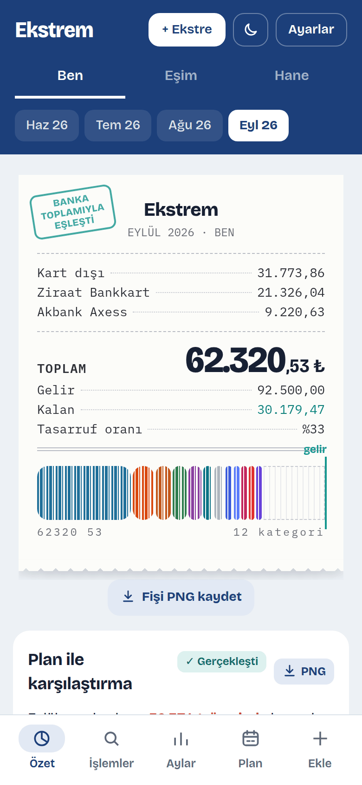 | 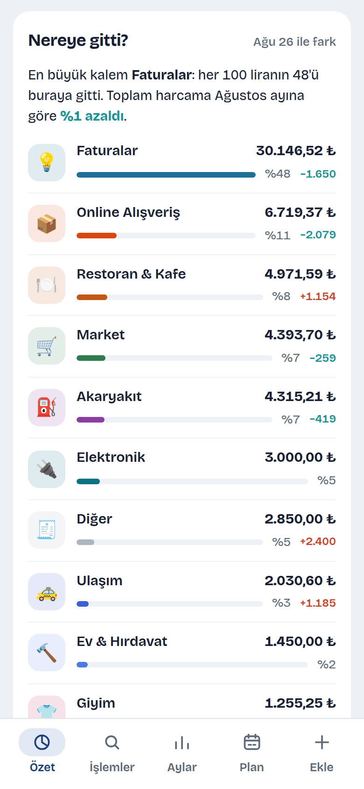 |

| Harcama takvimi | İşlemler ve arama |
|---|---|
| 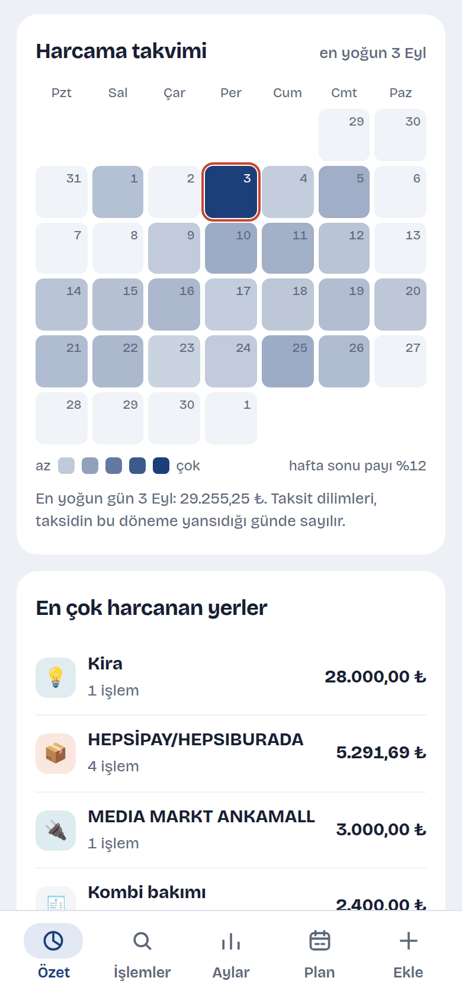 | 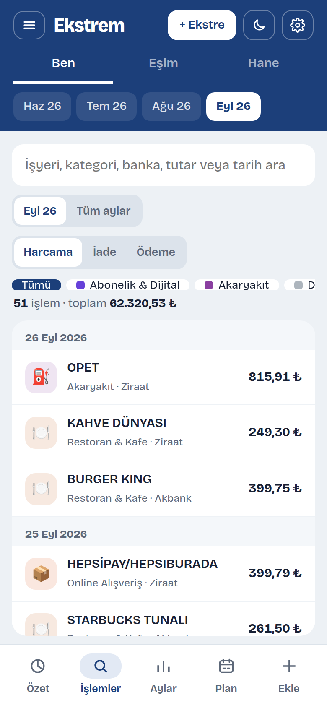 |

| Plan: nakit akışı | Plan: aylık bilanço |
|---|---|
| 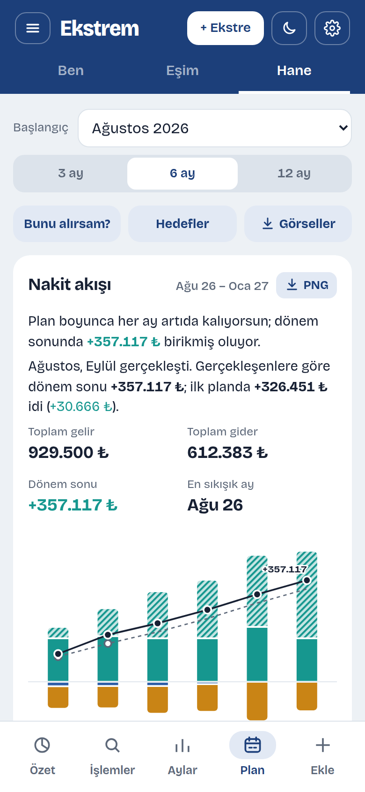 | 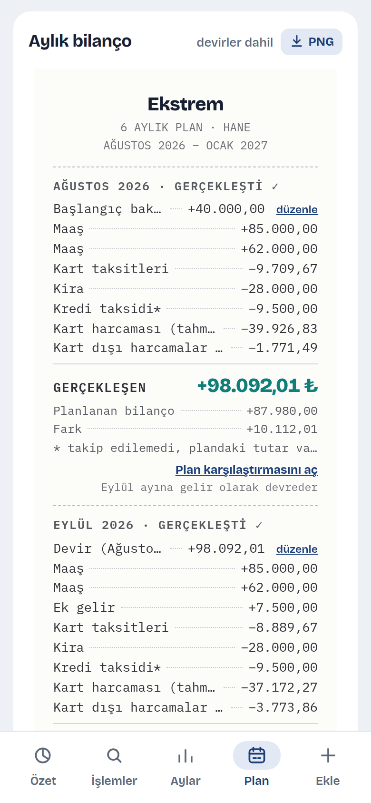 |

| Plan ile gerçekleşen | Taksit takvimi |
|---|---|
| 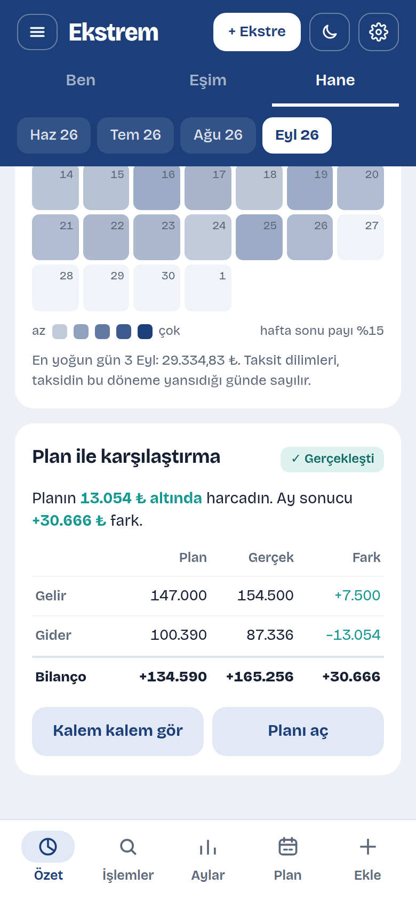 | 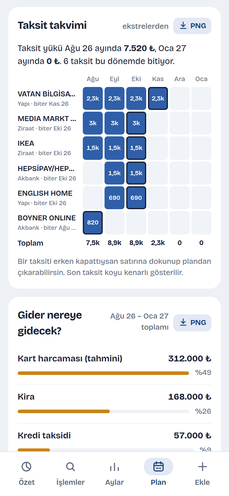 |

| Aylar | Koyu tema |
|---|---|
| 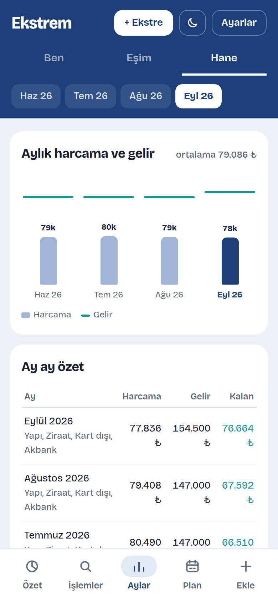 | 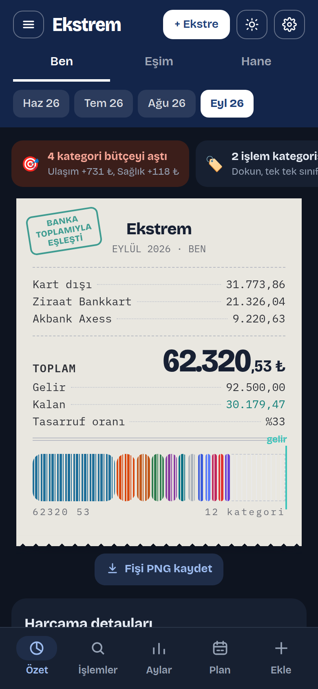 |

PNG çıktısı örnekleri:

| Nakit akışı | Aylık bilanço tablosu |
|---|---|
| 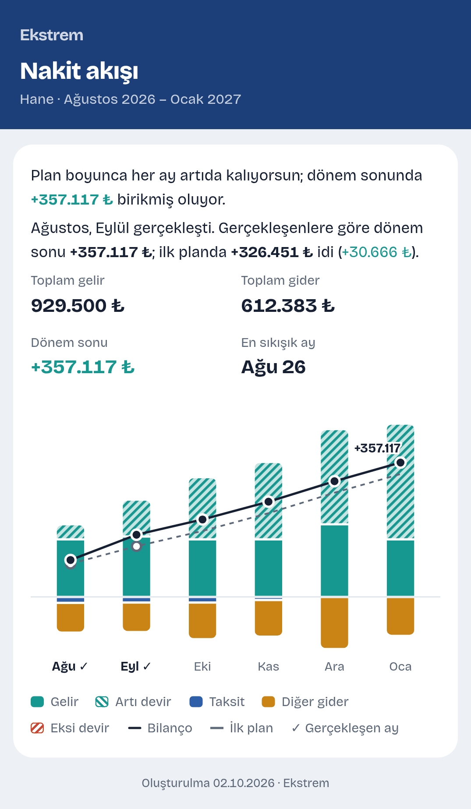 | 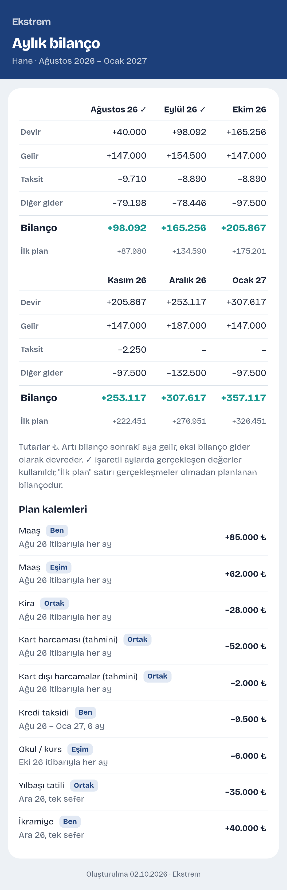 |

## Gizlilik

- Ekstreler telefonda okunur; PDF'ler ve işlemler hiçbir sunucuya gönderilmez. Uygulamanın bir sunucusu, hesabı ya da analitiği yoktur.
- Veriler uygulamanın kendi deposunda (IndexedDB) durur. Uygulama silinirse veriler de silinir; **Ayarlar → Yedekleme** ile yedek dosyası alınabilir. Android uygulaması ayrıca her kapanışta **Belgeler › Ekstrem › ekstrem-otomatik-yedek.json** dosyasına otomatik yedek yazar.
- Yedek dosyası tüm işlemlerinizi içerir; paylaşırken dikkat edin.

## Depo yapısı

```
src/                 Uygulamanın kaynak kodu (HTML, CSS, JavaScript)
  src.html           Arayüz iskeleti ve stiller
  app.js             Özet, işlemler, aylar, ekleme, ayarlar, içe aktarma
  plan.js            Plan, gerçekleşme karşılaştırması, tema, PNG çıktısı
  parser.js          Ziraat Bankkart ayrıştırıcısı
  generic.js         Genel ayrıştırıcı (Ziraat dışındaki tüm bankalar)
  cats.js            Kategori kuralları
  build.py           Hepsini tek dosyalık www/index.html olarak birleştirir
www/                 Derlenmiş uygulama (APK'nın içine giren tek HTML dosyası, ikonlar)
android-res/         Android uygulama ikonları
keystore/            Sürümler arası güncellemeyi sağlayan imza anahtarı
.github/workflows/   APK derleme ve sürüm yayınlama iş akışı
docs/                Kullanım ve geliştirme belgeleri, ekran görüntüleri
```

Derleme ve mimari için: **[docs/GELISTIRME.md](docs/GELISTIRME.md)** · Sürüm notları: **[CHANGELOG.md](CHANGELOG.md)**

## Lisans ve üçüncü taraf bileşenler

Aşağıdaki bileşenler uygulamanın içine gömülüdür; internet bağlantısı gerekmez.

- [PDF.js 3.11.174](https://mozilla.github.io/pdf.js/) — PDF okuma — Apache License 2.0
- [html-to-image 1.11.13](https://github.com/bubkoo/html-to-image) — PNG çıktısı — MIT
- [Bricolage Grotesque](https://github.com/ateliertriay/bricolage) ve [IBM Plex Mono](https://github.com/IBM/plex) yazı tipleri — SIL Open Font License 1.1
- Android paketi [Capacitor](https://capacitorjs.com) ile derlenir — MIT
